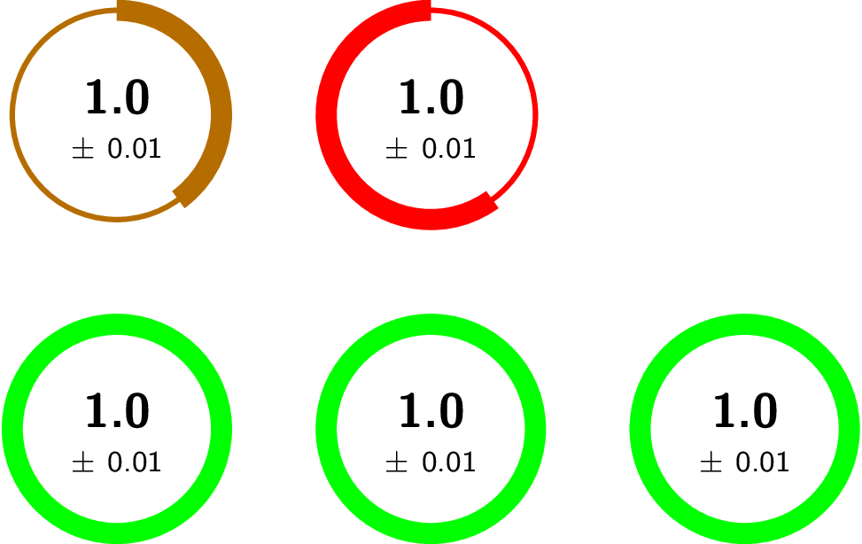

# StatDials

This is a pre-alpha python library to generate cute metric dials.


## Installation

`pip install statdials`

## Example usage

```
from statdials import StatDials

sd = StatDials(
[
    [
        {'metric': 1.0, 'uncertainty': 0.01, 'weight': 0.4, 'color': '{rgb:red,4;green,2;yellow,1}'},
        {'metric': 1.0, 'uncertainty': 0.01, 'weight': 0.6, 'weightOffset': 0.4, 'color': 'red'},
    ],
    [
        {'metric': 1.0, 'uncertainty': 0.01},
        {'metric': 1.0, 'uncertainty': 0.01},
        {'metric': 1.0, 'uncertainty': 0.01},
    ],
]
)

sd.generate_png()
```


